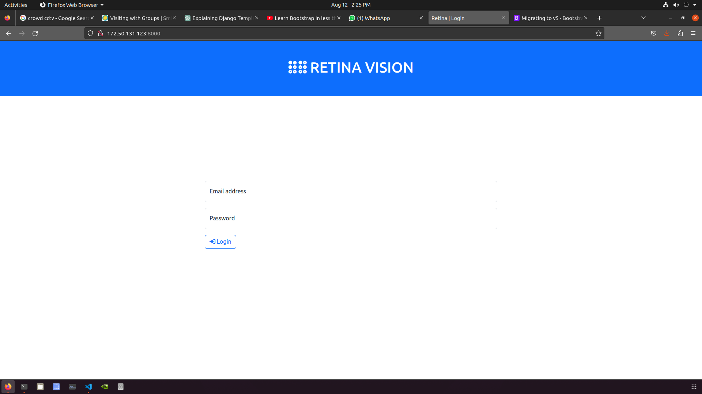

# Retina Vision 1.0.0

Retina Vision is a cutting-edge computer vision project that harnesses the power of the RetinaFace model for highly accurate face detection and precise facial landmark localization. This project aims to seamlessly integrate the RetinaFace model into an on-premise server environment using the Django web framework. Additionally, a Flask server deployed on a Raspberry Pi further enhances the project's capabilities by capturing real-time camera frames for face detection and analysis.


## Table of Contents

- [Project Overview](#project-overview)
- [Features](#features)
- [Architechture](#Architechture)
- [Prerequisites](#prerequisites)
- [Installation](#installation)
- [Intracting with the UI](#Intracting-with-the-UI)
- [Project Structure](#project-structure)
- [About The Model](#About-The-Model)
- [Credits](#credits)


# Project Overview

In the realm of computer vision, Retina Vision stands as a remarkable endeavor, showcasing the potential of deep learning technologies and web-based solutions. The project harmonizes the proficiency of modern neural network models with user-friendly interfaces, resulting in a practical tool for uploading images, capturing camera frames, and obtaining insightful face analysis results.

# Features

- **Precise Face Detection and counting :** Retina Vision utilizes the RetinaFace model's sophisticated architecture to perform accurate face detection and counting even in challenging scenarios.
- **Facial Landmark Localization:** In addition to face detection, the model accurately estimates facial landmarks, providing valuable insights into face structure.
- **User-Friendly Interface:** The project offers an intuitive web interface, allowing users to upload images, capture camera frames, and visualize the results.
- **Real-Time Analysis:** With the integration of Flask on a Raspberry Pi, Retina Vision captures camera frames and processes them on-the-fly for instant face analysis.
- **Easily Accessible Results:** The web interface elegantly presents the outcomes of face detection and counting, making the insights accessible to users.


# Architechture

.gif)


# Prerequisites

To make the most of Retina Vision, ensure that you have the following prerequisites installed:

- Python 3.7+
- Django
- Flask
- OpenCV
- TensorFlow (for RetinaFace model)
- Pillow (PIL)

# Installation

To get Retina Vision up and running on your local environment, follow these steps:

#### Prerequisites

Before you begin, ensure you have the following prerequisites installed:

- Python 3.7+
- Django
- Flask
- OpenCV
- TensorFlow (for RetinaFace model)
- Pillow (PIL)

#### Clone the Repository

```bash
git clone https://github.com/your-username/retina-vision.git
cd retina-vision
```

#### Integrating the Face Detection Model
##### Download Trained model weights
https://drive.google.com/drive/folders/1uwBmsw9cGMqLZwGueqk4JnigLN90tCcE?usp=sharing

Download the Model folder and paste in the directory  

#### Set Up Django Server

###### Navigate to the Django project directory

```bash
cd django_app
```
####  Create a Conda environment named "myenv" and Install the required Python packages from the project's requirements file 
(you can replace "myenv" with your preferred name)

```bash
conda env create --name myenv --file=environments.yml
conda activate myenv
```

#### Install the required Python packages from the project's requirements file 

```bash
pip install -r requirements.txt
```

#### Apply the database migrations for the Django app

```bash
python manage.py makemigrations
python manage.py migrate
```

#### Create a Superuser
##### Create a super user account to access the Django admin interface
```bash
python manage.py createsuperuser
```

#### Start the Django development server
```bash
python manage.py runserver
```


The Django server will be accessible at http://localhost:8000


### Configure Raspberry Pi and Flask Server

#### Navigate to the Flask server directory

```bash
cd raspberry_pi_app
```

#### Install the necessary Python packages
```bash
pip install -r rasberry_req.txt
```

#### Run the Flask server
```bash
python app.py
```


### Note: Network Connection

For proper communication between the Raspberry Pi and the Django server, ensure that both devices are connected to the same network.

# Intracting with the UI


Retina Vision provides an intuitive user interface that facilitates face detection and analysis. Here's how you can interact with it:

1. **Login Page**

    

    - Access the project's web interface by navigating to http://localhost:8000 in your web browser.
    - The login page will prompt you to enter superuser credentials. Please use the credentials you created during the Django setup process.

2. **Home Page**

    

    - After successfully logging in, you'll be directed to the home page.
    - The side bar provides two options: "Count on Live Camera Image" and "Upload an Image and Count."

3. **Count on Live Camera Image**
  
    

    - Selecting this option will capture live frames from the connected camera on the Raspberry Pi.
    - The captured frames will be processed using the RetinaFace model to detect faces and estimate facial landmarks.
    - The face count and results will be displayed on the same page.

4. **Uploaded Image**

    

    - An uploaded image will be shown for face detection and analysis.

5. **Results**

    

    - The analyzed image will be displayed, highlighting the detected faces and facial landmarks.
    - The face count will be provided as well.


# Project Structure

### Directory Structure of Django_app

Here is the directory structure of the djando app :

- **counter**: Contains the Django app for people counting.
  - **admin.py**: Django admin configuration for the app.
  - **apps.py**: Configuration for the app.
  - **migrations**: Stores database migration files.
  - **models.py**: Defines database models.
  - **serializer.py**: Serialization for app data.
  - **tests.py**: Test cases for the app.
  - **views.py**: Defines views for the app.

- **db.sqlite3**: SQLite database file.

- **manage.py**: Django management script for project tasks.

- **Model**: Contains modules and the RetinaFace model.
  - **modules**: Includes utility functions and the RetinaFace model.
    - **retinaface_model**: Stores the RetinaFace model files.
      - **assets**: Model assets.
      - **keras_metadata.pb**: Keras metadata file.
      - **saved_model.pb**: Saved model file.
      - **variables**: Model variables.
    - **utils.py**: Utility functions used in the modules.
  - **retina.py**: Main module file.

- **RetinaVision**: The main Django project directory.
  - **asgi.py**: ASGI configuration for project.
  - **settings.py**: Django project settings.
  - **urls.py**: URL routing for the project.
  - **wsgi.py**: WSGI configuration for project.

- **static**: Holds static assets such as CSS and images.
  - **customcss**: Custom CSS files.
  - **images**: Stores images used in the project.

- **templates**: Contains HTML templates.
  - **base.html**: Base template for other templates to extend.
  - **home**: Holds HTML templates for the home page.
    - **home.html**: Home page template.
    - **login.html**: Login page template.
    - **modelresult.html**: Model result page template.
    - **sidebar.html**: Sidebar template.


The directory structure provides organization for different components of the project, including the Django app, model modules, static assets, templates, and more.


### Directory Structure of Flask_app

Here is an overview of the directory structure of the Retina Vision project:

- **app.py** : This file is the main Flask application that captures camera frames and serves them.
- **requirements.txt**: This file contains a list of required Python packages for the Flask application.
- **templates**: This directory contains HTML templates used for rendering web pages.

#### **templates** Directory

- **index.html**: An HTML template that serves as stram display of the  camera .


# About The Model
## Model Implementation

Retina Vision utilizes the **ResNet-50** model for efficient and accurate face detection and facial landmark localization. The ResNet-50 model is a deep convolutional neural network architecture that has proven to be effective in a variety of computer vision tasks.

### ResNet-50 Architecture

The ResNet-50 architecture consists of 50 layers, including convolutional layers, batch normalization, and skip connections (shortcuts). The presence of skip connections enables the network to effectively learn from deeper layers while mitigating the vanishing gradient problem.

### RetinaFace for Face Detection

The ResNet-50 model has been fine-tuned for face detection in the RetinaFace framework. It has been trained on large datasets with annotated faces and facial landmarks, allowing it to accurately detect faces of varying sizes and orientations.

### Facial Landmark Localization

The facial landmark localization is achieved through the intermediate layers of the ResNet-50 model. The model identifies key facial landmarks such as the eyes, nose, and mouth, which provides valuable insights into the facial structure.

### Inference and Results

The trained ResNet-50 model enables Retina Vision to process input images and camera frames for face detection and analysis. The project's user interface seamlessly integrates the model to provide real-time face count and visualization of detected faces and facial landmarks.


# Credits

Thanks for these source codes porviding me with knowledges to complete this repository.

- https://github.com/peteryuX/retinaface-tf2#Models


